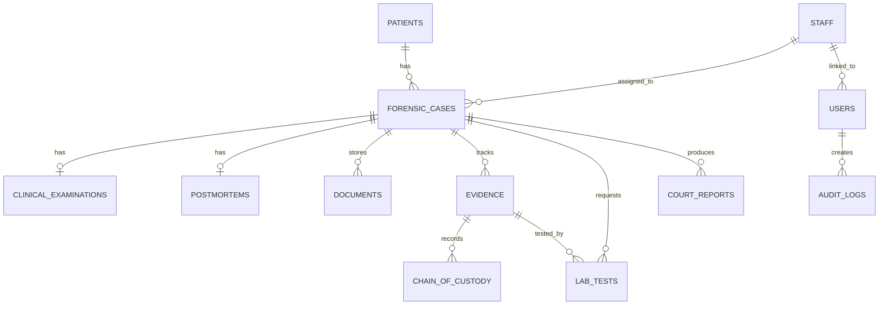

# Forensic Medicine Department Database System Design

## 1. System Overview

This system is a computerized database system for a Forensic Medicine Department. It replaces a mainly paper-based record process with a secure local web application backed by a MySQL relational database.

The system manages two major forensic medicine components:

- Clinical forensic cases, including MLEF records, clinical findings, investigations, referrals, police copies, and medico-legal reports.
- Autopsy/postmortem cases, including PMR records, inquest/court orders, pre-autopsy information, postmortem findings, cause-of-death status, histology, and court reports.

It also manages supporting department work such as patient records, evidence tracking, chain of custody, laboratory tests, documents, staff, users, audit logs, reports, analytics, and backup.

## 2. Main Objectives

The design supports the database module assignment objectives:

- Design a real-world relational database system.
- Identify entities, attributes, relationships, primary keys, and foreign keys.
- Apply normalization and referential integrity.
- Implement the database physically in MySQL.
- Build a frontend and backend that interact with the database.
- Provide meaningful reports and SQL views.
- Include confidentiality, authentication, role-based access, and audit logging.
- Demonstrate backup and recovery concepts.

## 3. Technology Stack

| Layer | Technology | Reason |
| --- | --- | --- |
| Database | MySQL 8+ | Suitable for relational database design, constraints, views, indexing, and assignment demonstration. |
| Backend | Python Flask | Lightweight web framework for routes, forms, sessions, and database integration. |
| Database Driver | PyMySQL | Allows Flask to connect to MySQL. |
| Frontend | HTML, CSS, JavaScript, Jinja templates | Simple local frontend served by Flask. |
| Local Runtime | Browser + local Flask server | Runs fully on the student's computer. |

SQLite files are kept only for fallback testing. The main assignment database is MySQL.

## 4. Project Structure

```text
Forensic/
  codes/
    Backend/
      app.py
      run_server.py
      requirements.txt
    Frontend/
      templates/
      static/
  data/
    mysql_forensic_database.sql
    sqlite_schema.sql
    sqlite_seed.sql
  docs/
    DATABASE_DESIGN.md
  backups/
  logs/
  tests/
  README.md
  DESIGN.md
  QUICK_DEPLOY.md
  FULL_STACK_INTEGRATION.md
  start.ps1
  start.bat
  start.sh
```

## 5. Runtime Architecture

The system runs locally using one backend server and one MySQL server.

```text
Web Browser
  -> Flask application routes
  -> HTML templates and static CSS/JS
  -> PyMySQL database connection
  -> MySQL database forensic_medicine_db
```

The frontend does not need a separate frontend development server. Flask renders the templates from `codes/Frontend/templates` and serves CSS/JavaScript from `codes/Frontend/static`.

## 6. Local Execution Flow

1. Start MySQL service.
2. Run `data/mysql_forensic_database.sql` in MySQL Workbench.
3. Start Flask using `start.ps1`.
4. Open the browser at `http://127.0.0.1:5000/login`.
5. Login using a demo user.
6. Use the system modules through the web interface.

## 7. Database Name and User

The MySQL script creates:

| Item | Value |
| --- | --- |
| Database | `forensic_medicine_db` |
| App user | `forensic_user` |
| Password | `forensic123` |
| Host | `localhost` and `127.0.0.1` |

The backend reads these values through environment variables in `start.ps1`.

## 8. User Roles

| Role | Purpose |
| --- | --- |
| `admin` | Full system access, user management, staff management, backup and restore. |
| `doctor` | Clinical, autopsy, reports, evidence, lab requests, patient and case records. |
| `clerk` | Patient registration, case registration, documents, court reports, search and analytics. |
| `lab` | Evidence and laboratory testing workflow. |
| `researcher` | Read-only search and reporting access for research/statistics. |

Role-based access control is enforced in the backend before each protected route is executed.

## 9. Core Database Tables

| Table | Purpose |
| --- | --- |
| `patients` | Stores personal and identification details of patients/deceased persons. |
| `forensic_cases` | Main case table for both clinical and autopsy cases. |
| `clinical_examinations` | Stores MLEF and clinical forensic examination details. |
| `postmortems` | Stores autopsy/PMR and cause-of-death related details. |
| `documents` | Tracks legal documents, MLEF copies, PMR scans, COD forms, receipts, and reports. |
| `evidence` | Stores forensic samples and evidence items. |
| `chain_of_custody` | Records movement and handling of evidence. |
| `lab_tests` | Stores investigation and laboratory test requests/results. |
| `court_reports` | Tracks MLR, PMR, COD, and court submission reports. |
| `staff` | Stores department staff details. |
| `users` | Stores login accounts and user roles. |
| `notifications` | Stores pending reminders such as report due dates and court dates. |
| `audit_logs` | Stores accountability records for important actions. |

## 10. Entity Relationship Design

Main relationships:

- One patient can have many forensic cases.
- One forensic case belongs to one patient.
- One forensic case can have one clinical examination if it is a clinical case.
- One forensic case can have one postmortem record if it is an autopsy case.
- One forensic case can have many documents.
- One forensic case can have many evidence items.
- One evidence item can have many chain-of-custody records.
- One forensic case can have many lab tests.
- One forensic case can have many court reports.
- One staff member can be assigned to many cases.
- One staff member can prepare many reports.
- One user may be linked to one staff member.
- One user can create many audit log records.



## 11. Primary Keys and Foreign Keys

Every table has an `id` primary key except where unique business identifiers are also required.

Examples:

- `patients.id` is referenced by `forensic_cases.patient_id`.
- `forensic_cases.id` is referenced by `clinical_examinations.case_id`, `postmortems.case_id`, `documents.case_id`, `evidence.case_id`, `lab_tests.case_id`, and `court_reports.case_id`.
- `staff.id` is referenced by `forensic_cases.assigned_doctor_id`, `evidence.collected_by_staff_id`, `lab_tests.requested_by_staff_id`, and `court_reports.prepared_by_staff_id`.
- `evidence.id` is referenced by `chain_of_custody.evidence_id` and `lab_tests.evidence_id`.
- `users.id` is referenced by `audit_logs.actor_user_id`.

Foreign keys enforce referential integrity and prevent orphan records.

## 12. Important Unique Fields

| Field | Reason |
| --- | --- |
| `patients.patient_no` | Unique hospital/department patient number. |
| `forensic_cases.case_no` | Unique medico-legal case number. |
| `clinical_examinations.mlef_no` | Unique MLEF number. |
| `postmortems.pmr_no` | Unique postmortem report number. |
| `evidence.evidence_code` | Unique evidence/sample code. |
| `lab_tests.test_code` | Unique lab investigation code. |
| `court_reports.report_no` | Unique report number. |
| `users.username` | Unique login username. |
| `staff.staff_code` | Unique staff code. |

## 13. Normalization Guidance

The design follows normalization principles:

First Normal Form:

- Attributes store atomic values.
- Repeating data such as documents, evidence items, reports, and lab tests are separated into their own tables.

Second Normal Form:

- Each non-key attribute depends on the table's whole primary key.
- For example, evidence storage details belong to `evidence`, not to `forensic_cases`.

Third Normal Form:

- Transitive dependencies are removed.
- Staff details are stored in `staff`, not repeated in case/report/evidence records.
- Patient details are stored in `patients`, not repeated in clinical or autopsy records.

This reduces duplication, improves consistency, and makes updates safer.

## 14. Database Constraints

The MySQL schema uses:

- `PRIMARY KEY` constraints for identity.
- `FOREIGN KEY` constraints for relationships.
- `UNIQUE` constraints for business identifiers.
- `ENUM` constraints for controlled values.
- `CHECK` constraint for patient age.
- `NOT NULL` constraints for required fields.
- `ON DELETE CASCADE` where child records must be removed with a parent case.
- `ON DELETE SET NULL` where historical records should remain after staff/user deletion.

## 15. Indexing Strategy

Indexes are included for frequently searched or joined fields:

- `idx_cases_patient`
- `idx_cases_category_status`
- `idx_clinical_mlef`
- `idx_postmortem_pmr`
- `idx_evidence_case`
- `idx_reports_case_status`
- `idx_audit_created`

These improve search, filtering, reporting, and join performance.

## 16. SQL Views

The system uses views for reporting and simplified queries:

| View | Purpose |
| --- | --- |
| `v_case_directory` | Combines case, patient, and doctor details for case search/listing. |
| `v_pending_reports` | Shows reports still requested or drafting. |
| `v_daily_case_report` | Counts daily clinical/autopsy cases. |
| `v_monthly_statistics` | Produces monthly case statistics grouped by category and type. |

These views are useful for assignment demonstration because they show SQL reporting beyond basic CRUD.

## 17. Main System Modules

### 17.1 Login and Security

Users must login before accessing the system. Passwords are stored as hashes, not plain text. After login, the backend stores the user ID in the session and checks permissions for each route.

### 17.2 Dashboard

The dashboard summarizes:

- Total patients.
- Total cases.
- Clinical cases.
- Autopsy cases.
- Pending reports.
- Pending laboratory tests.
- Notifications.
- Recent cases.
- Audit activity.

### 17.3 Patient Management

Functions:

- Register patient.
- Update patient.
- Delete patient.
- Search patient.
- Store patient number, name, NIC, age, gender, address, contact, and guardian/next-of-kin.

### 17.4 Case Management

Functions:

- Create clinical or autopsy case.
- Assign case number.
- Store incident details.
- Store legal authorisation type.
- Link patient and assigned doctor.
- Track case status.

### 17.5 Clinical MLEF Management

Functions:

- Record MLEF number.
- Store clinical history.
- Store examination findings.
- Store injuries.
- Store investigations.
- Store referral and review notes.
- Track police copy issue status.
- Track MLR status.
- Track next court date.

### 17.6 Postmortem Management

Functions:

- Record PMR number.
- Store death type.
- Store inquest/court order number.
- Store pre-autopsy information.
- Store external and internal findings.
- Store cause of death.
- Track COD status.
- Track histology status.
- Track court date.

### 17.7 Evidence Management

Functions:

- Register evidence/sample.
- Generate/store evidence code.
- Store evidence type and description.
- Store collection time and collector.
- Store current storage location.
- Track lab status.
- Display printable evidence label/barcode page.

### 17.8 Chain of Custody

Functions:

- Record every evidence movement.
- Store action type.
- Store from-holder and to-holder.
- Store handler, location, time, and notes.

This is important for forensic accountability.

### 17.9 Laboratory Test Management

Functions:

- Request tests for cases/evidence.
- Store test type.
- Track status.
- Store result.
- Store report reference.

Examples include toxicology, histology, DNA, swabs, and X-ray/CT.

### 17.10 Document Management

Functions:

- Record MLEF doctor copy.
- Record photographs.
- Record investigation findings.
- Record referral reports.
- Record summons.
- Record court/inquest orders.
- Record PMR scans.
- Record COD forms.
- Record issued report copies and certificates of receipt.

### 17.11 Court Report Management

Functions:

- Create reports such as MLR, PMR, COD, and court submissions.
- Track requested by, due date, submission date, status, prepared doctor, summary, and digital signature text.
- Display printable report page.

### 17.12 Staff and User Management

Admin can manage:

- Staff records.
- User accounts.
- User roles.
- Active/inactive status.

### 17.13 Search

Global search checks:

- Patients.
- Cases.
- Evidence.
- Reports.

This solves the original problem of difficult manual record retrieval.

### 17.14 Analytics and Reports

The analytics page uses SQL views to show:

- Daily case report.
- Monthly statistics.
- Pending reports.
- Lab test status.
- Death type statistics.

CSV export is available for selected reports.

### 17.15 Backup and Recovery

Admin can create database backups through the app. This demonstrates the assignment requirement for backup and recovery concepts.

## 18. Main Workflows

### Clinical Case Workflow

```text
Patient registered
  -> Clinical forensic case created
  -> MLEF examination recorded
  -> Evidence/lab tests added if needed
  -> Documents attached/registered
  -> MLR report generated
  -> Report status updated
  -> Court date or notification tracked
```

### Autopsy Case Workflow

```text
Patient/deceased record registered
  -> Autopsy case created
  -> Inquest/court order recorded
  -> PMR/postmortem details recorded
  -> Histology or lab tests added if needed
  -> COD/PMR report generated
  -> Court submission tracked
```

### Evidence Workflow

```text
Evidence registered
  -> Evidence code/barcode stored
  -> Collection details recorded
  -> Storage location recorded
  -> Chain-of-custody events added
  -> Lab tests requested
  -> Lab status/result updated
```

## 19. Backend Design

Main backend file:

```text
codes/Backend/app.py
```

Backend responsibilities:

- Create Flask app.
- Load templates/static folder paths.
- Connect to MySQL using PyMySQL.
- Handle login/logout.
- Enforce role-based route access.
- Handle CRUD operations.
- Execute parameterized SQL queries.
- Render pages.
- Create reports and CSV exports.
- Write audit logs.
- Handle backup operations.

The backend uses parameterized queries to reduce SQL injection risk.

## 20. Frontend Design

Frontend files:

```text
codes/Frontend/templates/
codes/Frontend/static/
```

Frontend responsibilities:

- Provide login page.
- Provide dashboard.
- Provide CRUD list pages.
- Provide data entry forms.
- Provide case detail pages.
- Provide evidence detail and label pages.
- Provide printable report pages.
- Provide analytics pages.

The UI is responsive and works in a local browser.

## 21. Security Design

Security features:

- Login required for protected pages.
- Hashed passwords.
- Session-based authentication.
- CSRF token on forms.
- Role-based access control.
- Audit logs for important actions.
- Separate database user for the application.

Confidential forensic records should only be accessible to authorized users.

## 22. Audit Logging

The `audit_logs` table records actions such as:

- Login.
- Logout.
- Create record.
- Update record.
- Delete record.
- Backup.
- Restore.
- Notification dismissal.
- Evidence custody update.

This provides accountability for medico-legal records.

## 23. Sample Data

The database script inserts sample data for:

- Staff.
- Users.
- Patients.
- Clinical cases.
- Autopsy cases.
- MLEF records.
- PMR records.
- Documents.
- Evidence.
- Chain of custody.
- Lab tests.
- Court reports.
- Notifications.

This allows immediate demonstration after running the MySQL script.

## 24. Demonstration Guide

Recommended demo order:

1. Show MySQL Workbench and the `forensic_medicine_db` schema.
2. Show tables, foreign keys, indexes, and views.
3. Open the app login page.
4. Login as `admin`.
5. Show dashboard statistics.
6. Open patient module and search a patient.
7. Open case module and show clinical/autopsy cases.
8. Open a clinical case and explain MLEF flow.
9. Open an autopsy case and explain PMR/COD flow.
10. Show evidence and chain of custody.
11. Show lab tests.
12. Show court report printable page.
13. Show analytics and CSV exports.
14. Show staff/user role management.
15. Show backup page.

## 25. Useful Viva Points

Good points to explain:

- The database is the central part of the system.
- `forensic_cases` is the main parent table for clinical and autopsy workflows.
- Clinical and autopsy details are separated because they have different attributes.
- Evidence and chain of custody are separated because one evidence item can move many times.
- Reports are separated because one case can generate many report types.
- Staff details are not duplicated; only staff IDs are referenced.
- Views are used for reporting and easier queries.
- Indexes improve search and reporting performance.
- Role-based access protects confidential forensic records.
- Audit logs improve accountability.

## 26. Current Limitations

This is a local assignment system, not a production hospital system. Current limitations:

- Uploaded file storage is represented using storage path fields.
- Email notifications are not actually sent.
- Barcode/QR support is represented through printable evidence labels.
- Digital signatures are represented as text.
- The Flask development server is used for local demonstration only.

## 27. Possible Future Improvements

Future improvements:

- Real file uploads for photos, PMR scans, COD forms, and reports.
- Real QR code generation.
- Email/SMS notification system.
- Full digital signature integration.
- Advanced audit log filtering.
- More detailed research anonymization.
- Deployment using a production WSGI server.
- Separate REST API and independent frontend framework if required.

## 28. Key Files

| File | Purpose |
| --- | --- |
| `data/mysql_forensic_database.sql` | Main MySQL database creation and seed script. |
| `codes/Backend/app.py` | Flask backend application. |
| `codes/Backend/run_server.py` | Starts local Flask server. |
| `codes/Frontend/templates/` | HTML frontend pages. |
| `codes/Frontend/static/styles.css` | Main frontend styling. |
| `README.md` | Local setup and run guide. |
| `docs/DATABASE_DESIGN.md` | Database-specific design notes. |
| `FULL_STACK_INTEGRATION.md` | Integration explanation. |
| `QUICK_DEPLOY.md` | Short local run guide. |

## 29. Final Summary

The system is designed as a complete local full-stack database application for a Forensic Medicine Department. The main focus is the MySQL relational database, which stores normalized forensic records with relationships, constraints, indexes, and views. The Flask backend provides secure access and business workflows, while the frontend gives users practical screens for data entry, search, reports, and analytics.
