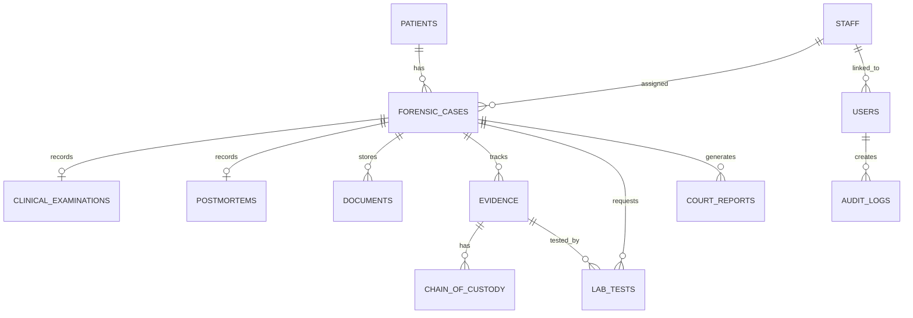

# Database Design Notes

## Conceptual Model

The system is centered around a forensic case. A patient can have many cases. A case is either clinical or autopsy. Clinical cases can have one MLEF examination record. Autopsy cases can have one PMR/postmortem record. Cases can have many documents, evidence items, laboratory tests, court reports, and notifications.

## Core Relations

| Table | Purpose |
| --- | --- |
| `patients` | Patient registration and demographic details. |
| `forensic_cases` | Medico-legal case registry with legal authorisation and assignment. |
| `clinical_examinations` | MLEF findings, police copy status, investigations, referrals, and MLR status. |
| `postmortems` | PMR/autopsy data, death type, COD status, histology status, and findings. |
| `documents` | MLEF copies, request letters, court orders, PMR scans, COD forms, receipts, and issued reports. |
| `evidence` | Forensic samples and evidence storage details. |
| `chain_of_custody` | Evidence movement log from collection through testing/storage/return. |
| `lab_tests` | Investigation requests and results. |
| `court_reports` | MLR, PMR, COD, court submission, and research report tracking. |
| `staff` | Doctors, JMOs, laboratory staff, clerical officers, and administrators. |
| `users` | Login accounts and roles. |
| `audit_logs` | Security and accountability trail. |

## Normalization Summary

- First Normal Form: tables store atomic values; repeating document/evidence/report groups are separated.
- Second Normal Form: non-key attributes depend on each table primary key, not partial composite keys.
- Third Normal Form: staff, patient, case, evidence, lab, document, and report details are separated to avoid transitive dependencies.
- Referential integrity is enforced with foreign keys and cascading behavior where records belong to a case.
- Controlled values such as roles, report status, death type, and case category are enforced with MySQL `ENUM` columns and selected `CHECK` constraints.

## Physical Design

Implemented in `data/mysql_forensic_database.sql` using MySQL:

- Primary keys on every table.
- Foreign keys between patients, cases, staff, evidence, tests, documents, and reports.
- Indexes on frequent search/reporting fields.
- `AUTO_INCREMENT` identifiers.
- `DATETIME DEFAULT CURRENT_TIMESTAMP` audit columns.
- `ON UPDATE CURRENT_TIMESTAMP` for mutable records.
- Views:
  - `v_case_directory`
  - `v_pending_reports`
  - `v_daily_case_report`
  - `v_monthly_statistics`

SQLite versions of the schema and seed data remain in `data/sqlite_schema.sql` and `data/sqlite_seed.sql` only for automated tests.

## Security Model

| Role | Access |
| --- | --- |
| `admin` | Full access, user management, backup/restore. |
| `doctor` | Clinical, autopsy, evidence, lab requests, reports, cases, patients. |
| `clerk` | Patients, cases, documents, court reports, search, analytics. |
| `lab` | Evidence and laboratory testing, read-only case context. |
| `researcher` | Read-only reporting/search views for analysis. |
